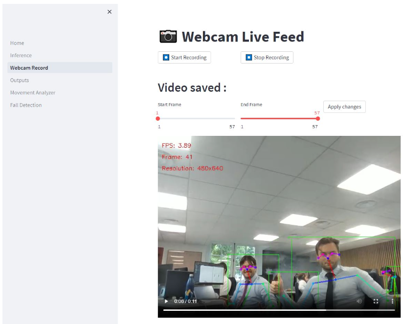
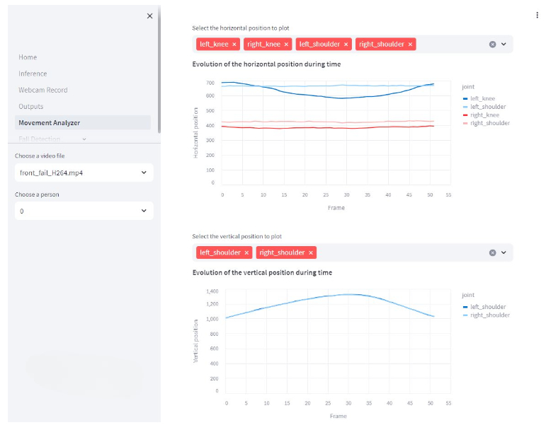
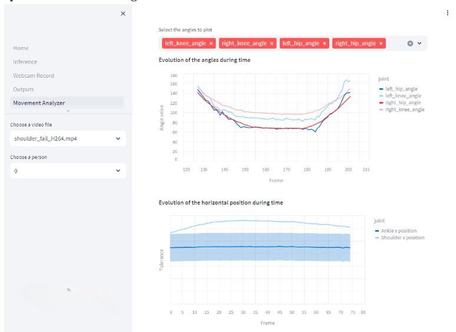
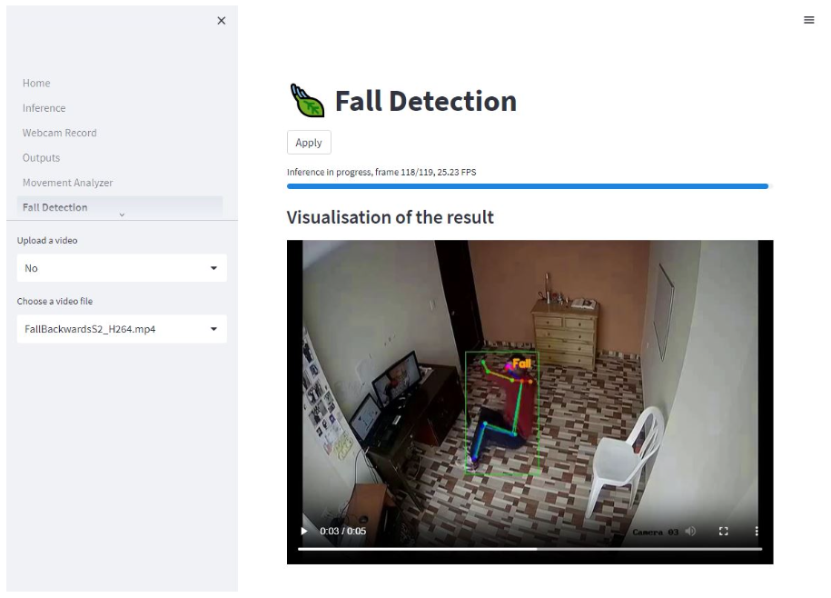
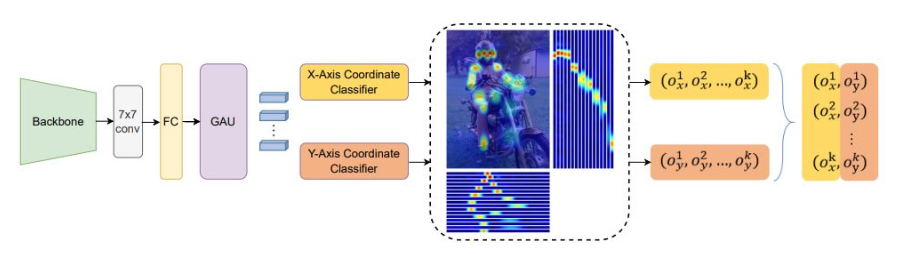

# PoseSpotterPro

## Introduction

This project represents the culmination of my final internship at ISAE-Supaero, where I developed a comprehensive solution for pose estimation. The solution consists of a back-end and a front-end, providing users with a powerful and intuitive interface to analyze movements through advanced machine learning techniques. The front-end is divided into multiple tabs, each designed to handle specific functionalities.

Below, I describe each tab, the technologies employed, and the key innovations implemented throughout the project. 🌟

## Tabs description

### Inference Tab 📸

This tab allows users to perform pose estimation on uploaded media. By selecting a detection model and a keypoint estimation model, the system processes images or videos and overlays the estimated poses on the input. It offers a straightforward way to analyze static or pre-recorded movements.


### Webcam Record Tab 🎥

Expanding on the functionality of the Inference Tab, this feature enables real-time pose estimation through the webcam. Users can interact dynamically with the models, seeing live feedback of their movements with accurate pose overlays, making it ideal for instant analysis.



### Movement Analyzer Tab 🏋️

Focusing on movement analysis, this tab currently supports squats. Users can select a previously processed video, and the system evaluates the motion using specific metrics. For squats, it examines factors like depth, knee alignment, and shoulder positioning. Errors are identified and highlighted within the video, providing clear feedback and counting repetitions for detailed analysis of each attempt.




### Fall Detection Tab 🚨

This tab leverages pose estimation and a custom-trained Random Forest model to identify falls in videos. By analyzing keypoint sequences and applying sliding averages, the system outputs probabilities for fall events. It is designed for reliable monitoring and has potential applications in safety and healthcare.



## Getting started

This is a project of a demostrater using Human Pose Estimation (HPE) to detect dangerous poses in a video stream. The project is based on MMPose.

### Virtual environment

To run this project you first need to to create a virtual environment with the following command:

```bash
NAME=mmposevenv
virtualenv --python=3.9 $NAME
source $NAME/bin/activate
pip install --upgrade pip
pip install -r requirements.txt
```

or with conda:

```bash
conda create -n mmposevenv python=3.9
conda activate mmposevenv
pip install -r requirements.txt
```

### Installing MMPose

Moreover you need to clone the [MMPose repository](https://github.com/open-mmlab/mmpose) at the root of this project (see the installation details).

```bash	
pip install -U openmim
mim install mmengine
mim install "mmcv>=2.0.0"
mim install "mmdet>=3.0.0"
```	


```bash	
cd mmpose
pip install -r requirements.txt
pip install -v -e .
cd ../
```

### Running the app

To run the app you need to run the following command at the root of the project:

```bash
streamlit run UserInterface/Home.py
```

## Technologies Used

This project integrates several advanced tools and libraries:

- [MMPose](https://mmpose.readthedocs.io/en/latest/overview.html)  for pose estimation. 🤖
- Streamlit to develop a user-friendly interface. 🖥️
- OpenCV for handling media processing. 🎞️
- Torch and Torchvision to power deep learning models. 🔥
- Sklearn for implementing the Random Forest model. 🌲
- Seaborn for creating insightful visualizations. 📊

## Pose Models

The solution is built on robust models from MMPose library: the main models used are [RTMDet](https://arxiv.org/abs/2212.07784) and [RTMPose](https://arxiv.org/abs/2303.07399), which are optimized for real-time pose estimation. These models are lightweight and efficient, making them ideal for real-time applications. 🚀

RTMPose architecture:



## Acknowledgments

I extend my gratitude to the academic and technical staff at ISAE-Supaero for their invaluable support throughout this project. 🙏 I also acknowledge the open-source community for their excellent tools, which made this work possible. 🦾